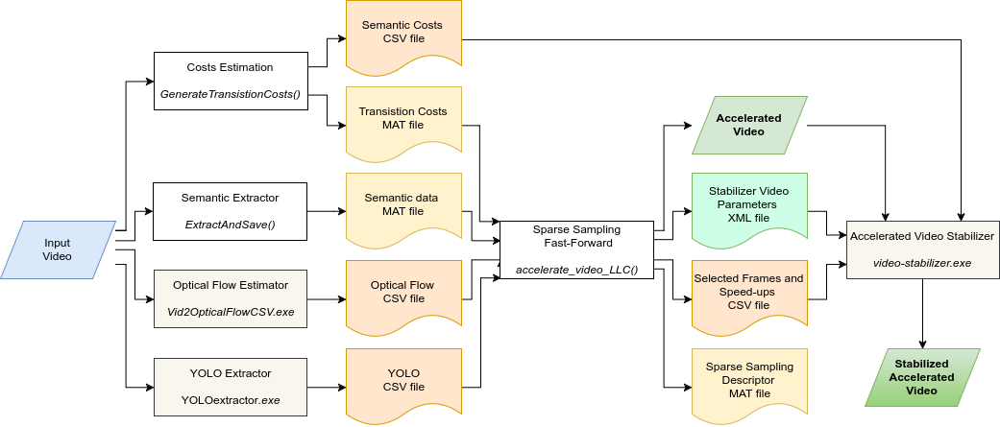

# Sparse Coding Semantic Hyperlapse

[](https://www.verlab.dcc.ufmg.br/semantic-hyperlapse)
[](LICENSE)

# Project #

This project has to code and data used to generate the results reported in the paper [A Sparse Sampling-based framework for Semantic Fast-Forward of First-Person Videos](https://www.verlab.dcc.ufmg.br/semantic-hyperlapse/tpami2020/) on the **IEEE Transactions on Pattern Analysis and Machine Intelligence (TPAMI) 2020**. It implements a semantic fast-forward method for First-Person videos with a proper stabilization method based on a adaptive frame selection via Minimum Sparse Reconstruction problem, Smoothing Frame Transition and Fill Gap Corretions steps.

For more information and visual results, please access the [project page](https://www.verlab.dcc.ufmg.br/semantic-hyperlapse).

## Contact ##

### Authors ###

* Michel Melo da Silva - PhD student - UFMG - michelms@dcc.ufmg.com
* Washington Luis de Souza Ramos - PhD student - UFMG - washington.ramos@outlook.com
* Mario Fernando Montenegro Campos - Advisor - UFMG - mario@dcc.ufmg.br
* Erickson Rangel do Nascimento - Advisor - UFMG - erickson@dcc.ufmg.br

### Institution ###

Federal University of Minas Gerais (UFMG)  
Computer Science Department  
Belo Horizonte - Minas Gerais -Brazil 

### Laboratory ###


**VeRLab:** Laboratory of Computer Vison and Robotics   
https://www.verlab.dcc.ufmg.br

## Code ##

This project is a two-fold source code. The first fold¹ is composed of MATLAB code to describe the video semantically and to fast-forward it using Sparse Coding representation. A stabilizer proper to fast-forwarded video written in C++ using OpenCV is the second fold². You can run each fold separately.

### Dependencies ###

* ¹MATLAB 2016a  
* ¹SPAMS 2.6  
* ²OpenCV 2.4 _(Tested with 2.4.9 and 2.4.13)_  
* ²Armadillo 6 _(Tested with 6.600.5 -- Catabolic Amalgamator)_  
* ²Boost 1 _(Tested with 1.54.0 and 1.58.0)_  
* ¹²Doxygen 1 _(for documentation only - Tested with 1.8.12)_  

### Usage ###

The project processing is decribed by the following flowchart:



1. **Optical Flow Estimator:**

    The first step processing is to estimate the Optical Flow of the Input VIdeo. 

    1. First, you should download the [Poleg et al. 2014](http://www.cs.huji.ac.il/~peleg/papers/cvpr14-egoseg.pdf) Flow Estimator code from the [link](http://www.vision.huji.ac.il/egoseg/EgoSeg1.2.zip).
    2. Navigate to the download folder and unzip the code.
    3. Into the Vid2OpticalFlowCSV\Example folder, run the command:

```bash
Vid2OpticalFlowCSV.exe -v < video_filename > -c < config.xml > -o < output_filename.csv >
```

| Options                     | Description                         | Type     | Example                       |
| --------------------------: | ----------------------------------- | -------- | ----------------------------- |
| ` < video_filename > `      | Path and filename of the video.     | _String_ | `~/Data/MyVideos/myVideo.mp4` |
| ` < config.xml > `          | Path to the configuration XML file. | _String_ | `../default-config.xml`       |
| ` < output_filename.csv > ` | Path to save the output CSV file.   | _String_ | `myVideo.csv`                 |

Save the output file using the same name of the input video with extension `.csv`.

2. **Semantic Extractor:**

    The second step is to extract the semantic information over all frames of the Input video and save it in a CSV file. 
    
    **First, you should go to the folder [@SemanticFastForward_JVCI_2018](./@SemanticFastForward_JVCI_2018) containing the Multi Importance Fast-Forward (MIFF) code \[[Silva et al. 2018](https://arxiv.org/pdf/1711.03473)\].**
    
    
    On the MATLAB console, go to the "SemanticScripts" folder inside the MIFF project and run the command:

```matlab
>> ExtractAndSave(< Video_filename >, < Semantic_extractor_name >)
```

| Parameters                      | Description                     | Type     | Example                     |
| ------------------------------: | ------------------------------- | -------- | --------------------------- |
| ` < video_filename > `          | Path and filename of the video. | _String_ | `~/Data/MyVideos/Video.mp4` |
| ` < semantic_extractor_name > ` | Semantic extractor algorithm.   | _String_ | `'face'` or `'pedestrian'`  |

3. **Transistion Costs Estimation:**

    The third step is to calculate the transition costs over all frames of the Input video and save it in a MAT file. On the MATLAB console, go to the "Util" folder inside the MIFF project and run the command:

```matlab
>> GenerateTransistionCost(< video_dir >, <experiment>, < semantic_extractor_name >, <speed_up>)
```

| Parameters                      | Description                      | Type      | Example                    |
| ------------------------------: | -------------------------------- | --------- | -------------------------- |
| ` < video_dir > `               | Complete path to the video.      | _String_  | `~/Data/MyVideos`          |
| ` < experiment > `              | Name to identify the experiment. | _String_  | `Biking_0p`                |
| ` < semantic_extractor_name > ` | Semantic extractor algorithm.    | _String_  | `'face'` or `'pedestrian'` |
| ` <speed_up> `                  | Desired speed-up rate            | _Integer_ | ` '10' `                   |

This function also save the Semantic Costs in a CSV file, which will be used in the Video Stabilizer. The files are saved in the same folder of the video (` < video_dir > `).

4. **Yolo Extractor**

To use the Yolo Extractor:
1. Clone the Yolo repository: `git clone https://github.com/pjreddie/darknet.git`
2. Go to darknet folder: `cd darknet/`
3. To make sure you using the same code, go back to an specific commit: `git reset b3c4fc9f223d9b6f50a1652d8d116fcdcc16f2e8 --hard`
4. Copy the files from `_Darknet` to the `src/` folder
5. Modify the `Makefile` to match your specification.
6. Run `make`

To use the extractor run:

   `./darknet detector demo <data file> <cfg file> <weights> <video file> <output file> ` 

| Fields              | Description                           | Type     | Example                |
| ------------------: | ------------------------------------- | -------- | ---------------------- |
| ` < data file > `   | Model configuration file.             | _String_ | `cfg/coco.data`        |
| ` < cfg file > `    | Model configuration file.             | _String_ | `cfg/yolo.cfg`         |
| ` < weights > `     | Weights file for the desired model.   | _String_ | `yolo.weights`         |
| ` < video file > `  | Video file to extrack the detections. | _String_ | `example.mp4`          |
| ` < output file > ` | File created to save yolo results.    | _String_ | `example_yolo_raw.txt` |

The output file contains all information extracted from the video. Example:

```
3, 4.000000
0, 0.407742, 490, 13, 543, 133
58, 0.378471, 982, 305, 1279, 719
58, 0.261219, 80, 5, 251, 121
1, 5.000000
58, 0.451681, 981, 307, 1279, 719
```
The first line contains two informations, the number of boxes detected and the number of the frame. Each one of the following lines contains the information about each detected box. 
It is formated as:

```
<Number of boxes> <frame number>
<Class> <Confidence> <X> <Y> <Height> <Width>
<Class> <Confidence> <X> <Y> <Height> <Width>
<Class> <Confidence> <X> <Y> <Height> <Width>
<Number of boxes> <frame number>
<Class> <Confidence> <X> <Y> <Height> <Width>
...
```

After extracting all this information, you need to generate the descriptor.

`python generate_descriptor.py <video_path> <yolo_extraction> <desc_output>`

| Fields                  | Description                  | Type     | Example                 |
| ----------------------: | ---------------------------- | -------- | ----------------------- |
| ` < video_path > `      | Path to the video file.      | _String_ | `example.mp4`           |
| ` < yolo_extraction > ` | Path to the yolo extraction. | _String_ | `example_yolo_raw.txt`  |
| ` < desc_output > `     | Path to the descriptor.      | _String_ | `example_yolo_desc.csv` |


5. **Semantic Fast-Forward**

    After the previous steps, you are ready to accelerate the Input Video. On MATLAB console, go to the "LLC" folder, inside the project directory and run the command:

```matlab
>> accelerate_video_LLC( < experiment > , < semantic_extractor > );
```
| Fields                     | Description                                  | Type     | Example                    |
| -------------------------: | -------------------------------------------- | -------- | -------------------------- |
| ` < experiment > `         | Name to identify the experiment.             | _String_ | `Biking_0p`                |
| ` < semantic_extractor > ` | Descriptor used into the semantic extraction | _String_ | `'face'` or `'pedestrian'` |
